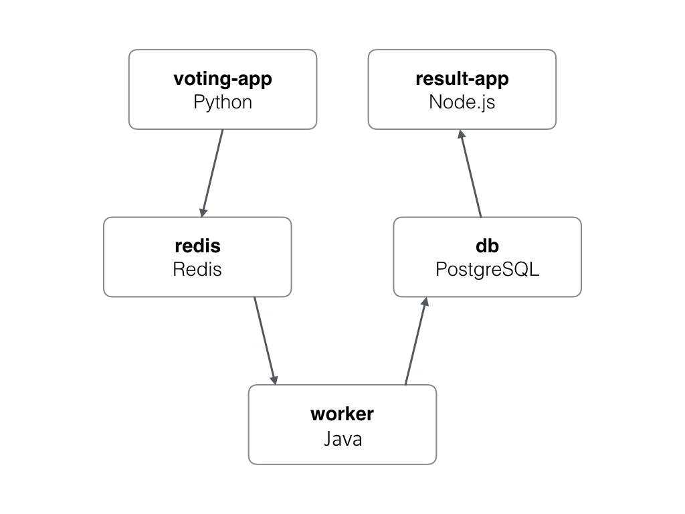

Example Voting App
=========

TODO
----

* Implement autoscaling options (understand node-pools)
* Implement workflow for declarative configuration update
* Integrate Istio (see https://github.com/thesandlord/Istio101)

What is it?
-----------

A simple distributed application running across multiple Docker containers. Forked from the docker sample voting app (https://github.com/dockersamples/example-voting-app) and modified to run in GKE. Handy Makefile implementation idea stolen from https://github.com/thesandlord/Istio101.

Architecture
-----

* A front-end web app in [Python](/vote) which lets you vote between two options
* A [Redis](https://hub.docker.com/_/redis/) queue which collects new votes
* A [Java](/worker/src/main) worker which consumes votes and stores them in…
* A [Postgres](https://hub.docker.com/_/postgres/) database backed by a Docker volume
* A [Node.js](/result) webapp which shows the results of the voting in real time

Getting started
---------------

For an easy life - start a project on GCP, run the Cloud Shell and clone this repo.

look in the Makefile for the various recipies to build a cluster and deploy the application containers. 

Basic getting started:

Clone this repo `git clone https://github.com/ip999/example-voting-app.git`

From within the repo directory `cd example-voting-app`:

`make enable-apis` to Enable the (compute & container APIs) can take a couple of minutes

`make create-cluster` to create the kubernetes cluster on GKE (takes a couple of minutes)

`make create-deployments` to deploy the vote application

`make get-vote-ip` to get the EXTERNAL-IP for "vote" and `make get-result-ip` for "result"

'make art-run' to batter the app with random votes.

This will also include the port numbers. By default the vote interface is available on port 5000, result is available on port 5001.

Note
----

The original voting application only accepted one vote per client, this has been brutally modified (by ignoring cookie checks).
